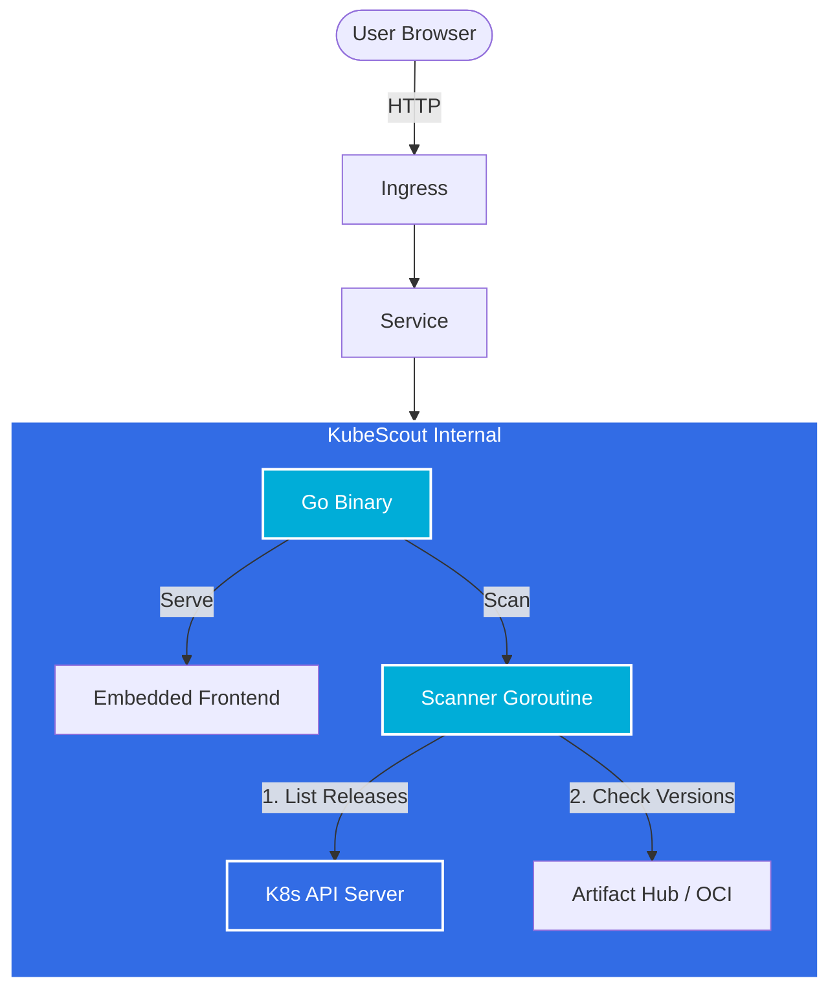

# 🔭 KubeScout

> **Zero-Config, Ultra-Lightweight, Drift-Aware.**


**KubeScout** is a lightweight, single-binary tool designed to run inside your Kubernetes cluster. It immediately visualizes how your installed Helm charts differ from their latest upstream versions—without any complex configuration. Just deploy and see the drift.

---

## 🚀 Mission

**"Zero-Config, Ultra-Lightweight."**

Our goal is to assist Kubernetes operators in maintaining cluster health by visualizing "Configuration Drift" instantly. No heavy agents, no external databases—just a simple, powerful scout for your Helm charts.

## ✨ Key Features

### 🎯 Core Capabilities (MVP)
- **Cluster Discovery**: Automatically detects Helm releases across namespaces (Release Name, Chart, Version).
- **Upstream Check**: Real-time comparison with Artifact Hub for the latest versions.
- **Smart Hybrid Discovery**: Uses a **Preset Registry** for known charts (ArgoCD, KEDA, etc.) to ensure 100% accuracy, falling back to a **Star-based Search** for others. [Read more](./docs/discovery-logic.md).
- **Semantic Comparison**:
  - 🟢 **Sync**: Fully up-to-date.
  - 🟡 **Minor Drift**: Minor/Patch updates available (Upgrade Recommended).
  - 🔴 **Major Drift**: Major version differences (Breaking Changes possible).
- **Simple Dashboard**: A memory-cached, single-page dashboard. No persistent DB required.

### 🔬 Advanced Features (Planned)
- **Image Tag Mismatch Detection**: Deep analysis of `values.yaml` vs rendered manifests to catch image tag drifts.
- **Private Repo Support**: Seamless integration with ECR/Harbor via K8s Secrets for internal charts.
- **Smart Caching**: In-memory caching to respect API rate limits.
- **Alert Fatigue Management**: Ack/Silence specific drifts via ConfigMaps.

## 🛠️ Architecture

KubeScout runs as a stateless pod, serving a compiled React frontend from a Go binary.



## 🗺️ Roadmap

### Phase 1: Core Engine (Week 1)
- [ ] Go Environment Setup & Helm SDK Integration
- [ ] In-cluster Helm Release Extraction (JSON)
- [ ] Artifact Hub API Integration & Version Matching

### Phase 2: Web Server & UI (Week 2)
- [ ] REST API Server (Gin/Echo)
- [ ] React Dashboard Implementation
- [ ] `embed` Frontend Assets into Go Binary

### Phase 3: Advanced Logic (Week 3)
- [ ] SemVer Parsing & "Warning" Logic Refinement
- [ ] Docker Optimization (Multi-stage build)
- [ ] PoC Deployment

## 🐳 Docker Support

Build and run KubeScout as a container:

```bash
# Build the image
docker build -t kubescout:latest .

# Run with local kubeconfig mounted (Docker)
docker run -p 8080:8080 \
  -v ~/.kube:/nonroot/.kube \
  -e KUBECONFIG=/nonroot/.kube/config \
  kubescout:latest
```

## 💻 Tech Stack

- **Backend**: [Go (Golang)](https://go.dev/)
  - Utilizes `client-go` and `helm/pkg` for native performance.
- **Frontend**: [React](https://react.dev/) + [Vite](https://vitejs.dev/) + [Tailwind CSS](https://tailwindcss.com/)
  - Extremely fast and lightweight UI.
- **Distribution**: Docker Image (Scratch / Distroless Base)

## 🤝 Contributing

Contributions are welcome! Please feel free to submit a Pull Request.

## 📄 License

This project is licensed under the MIT License.
